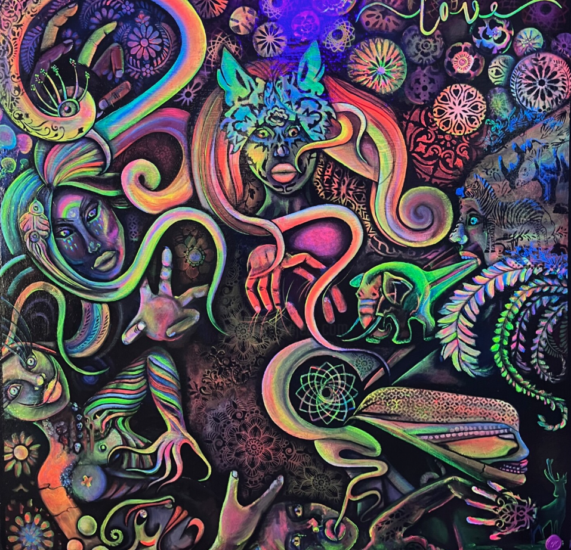
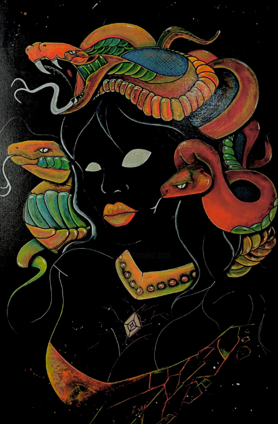
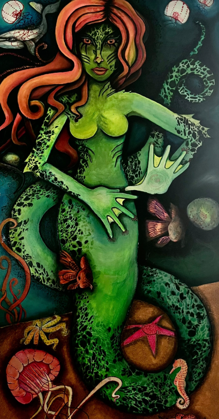

  

## Hi there 👋  
I'm **Lili Mayerhöfer Kárándi**

✨ Artist | 📊 Data Analyst | 🚀 Creator of *Lightscapes*

---

✧ ⟡ ✶ ⟡ ✧

---

### 🌌 About Me
I blend **neon art & blacklight creativity** with **data-driven thinking**.  
My work connects **emotion, energy & storytelling** with **analytics and technology**.

---

✧ ⟡ ✶ ⟡ ✧

---

### 🎨 Creative Work
- Neon & blacklight paintings (*Lightscapes*)
- Custom bodypainting & wearable art
- Fluorescent fashion & wall designs
- Digital designs & print templates

---

✧ ⟡ ✶ ⟡ ✧

---

### 📊 Data & Tech

  

  
  
  

- Excel | Power BI
- Python
- PostgreSQL (pgAdmin)
- Cloud basics (Azure)

I love turning **data into clarity** and **ideas into visual experiences**.

---

✧ ⟡ ✶ ⟡ ✧

---

### ⚡ What Drives Me
- Creativity without limits  
- Personal growth & transformation  
- Combining art + logic  
- Building something meaningful  

---

✧ ⟡ ✶ ⟡ ✧

---

### 🌱 Currently
- Expanding my data analytics skills  
- Growing my creative business  
- Creating unique visual experiences  

---

✧ ⟡ ✶ ⟡ ✧

---

### 📫 Connect with Me

✨ Artist | 📊 Data Analyst | Creator of *Lightscapes*  

---

✧ ⟡ ✶ ⟡ ✧

---

### 🌌 About Me
I combine **neon art & blacklight creativity** with **data analytics**.  
I create visual experiences that connect **emotion, energy & data**.

---

✧ ⟡ ✶ ⟡ ✧

---

### 🎨 My Art

### 🌌 Artwork Transformation

## ✧ Visual Impressions

  
  
  

---

## 🎨 My Blacklight Art

  
  
  

  

---

✧ ⟡ ✶ ⟡ ✧

---

### 📊 Data Skills
- Excel  
- Power BI  
- Python  
- PostgreSQL (pgAdmin)  
- Azure (Basics)

---

✧ ⟡ ✶ ⟡ ✧

---

### ⚡ Vision
Create something unique by combining  
**art, technology & energy**

---

✧ ⟡ ✶ ⟡ ✧

---

### 📫 Contact
💌 Open for collaborations & custom artwork  

---

✧ ⟡ ✶ ⟡ ✧

---

✨ *Never stop creating* ✨

- 💌 DM / Contact me for collaborations
- 🎨 Custom art & design projects available

---

✨ *Never stop creating. Never stop growing.* ✨
