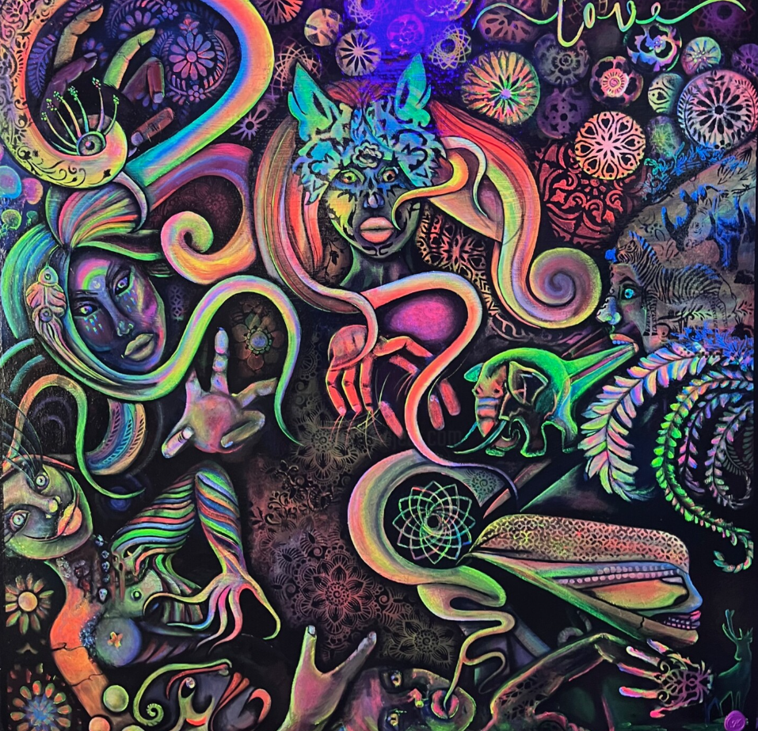
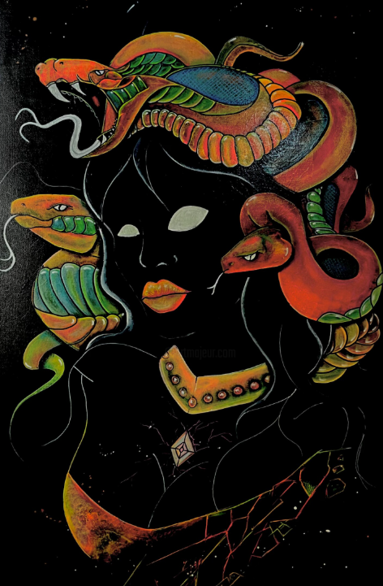
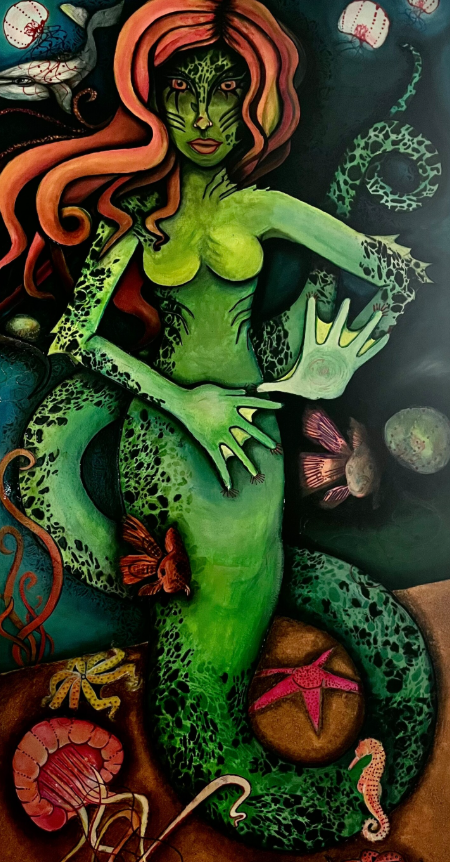

  

  

  

⚡ Daten verstehen • Klarheit schaffen • Wirkung erzeugen ⚡

---

## 🚀 Data Analystin | Offen für Remote-Positionen

✔ SQL • Python • Power BI  
✔ Datenbereinigung • Analyse • Visualisierung  
✔ Strukturierte Arbeitsweise & analytisches Denken  

💡 Ich verwandle Rohdaten in klare, verständliche und nutzbare Erkenntnisse.

---

## 📊 Daten & Technologien

  

  
  
  

Excel • Power BI • Python • PostgreSQL • Azure (Grundlagen)

---

## ⚡ Ausgewählte Projekte

---

### 🛒 Olist E-Commerce Analyse

📊 **Ziel:**  
Analyse von Verkaufs- und Kundendaten zur Erkennung von Trends und Optimierungspotenzialen  

⚙️ **Technologien:**  
SQL • PostgreSQL • Datenmodellierung • BI-Vorbereitung  

📈 **Erkenntnisse:**  
- Umsatzentwicklung über Zeit analysiert  
- Schwache Produktkategorien identifiziert  
- Top-Kunden und Verkäufer herausgearbeitet  

🧠 **Nutzen:**  
Unterstützt datenbasierte Entscheidungen zur Umsatzsteigerung  

🔗 https://github.com/designlili/Olist_db  

---

### 🏢 Northwind Datenanalyse

📊 Analyse klassischer Unternehmensdaten zur Untersuchung von Verkaufsprozessen und Kundenstrukturen  

🔗 https://github.com/designlili/Northwind  

---

### 🧠 Smart Laundry Reminder

📊 Kombination aus Logik, Automatisierung und nutzerfreundlicher Anwendung  

🔗 https://github.com/designlili/smart-laundry-reminder  

---

### 🎨 Lightscapes Projekte

✨ Verbindung von kreativer Energie mit digitalem Design  

🔗 https://github.com/designlili/lightscapes-neon-energy  
🔗 https://github.com/designlili/lightscapes-fire-interface  

---

## 🌌 Über mich

Ich verbinde **Datenanalyse** mit **kreativem Ausdruck**.  

Meine Arbeit vereint:  
✨ Emotion & Storytelling  
📊 Daten & Struktur  
🚀 Technologie & Vision  

---

## ✨ Mein Ansatz

Ich kombiniere **kreatives Denken** mit **analytischer Problemlösung**  

→ Muster erkennen – sowohl in Daten als auch im Verhalten  
→ Komplexe Inhalte verständlich und klar darstellen  

---

## 🎨 Kreative Arbeit

- Neon- & Schwarzlichtkunst (*Lightscapes*)  
- Bodypainting & tragbare Kunst  
- Fluoreszierende Mode & Wandgestaltung  
- Digitale Designs & Druckvorlagen  

---

## ✧ Visuelle Eindrücke

  
  
  

---

## ⚡ Was mich antreibt

- Kreativität ohne Grenzen  
- Persönliches Wachstum  
- Verbindung von Logik & Intuition  
- Etwas Sinnvolles schaffen  

---

## 🌱 Aktuell

- Ausbau meiner Data-Analytics-Skills  
- Weiterentwicklung meiner kreativen Marke  
- Umsetzung praxisnaher Datenprojekte  

---

## 🚀 Vision

Etwas Einzigartiges schaffen durch die Verbindung von  
**Kunst • Daten • Energie • Technologie**

---

## 📫 Kontakt

💌 Offen für Projekte, Zusammenarbeit & Remote-Positionen  

- Data Analytics  
- Kreative Projekte  
- Individuelle Designs  

---

✨ <i>Nie aufhören zu wachsen. Nie aufhören zu erschaffen.</i> ✨

